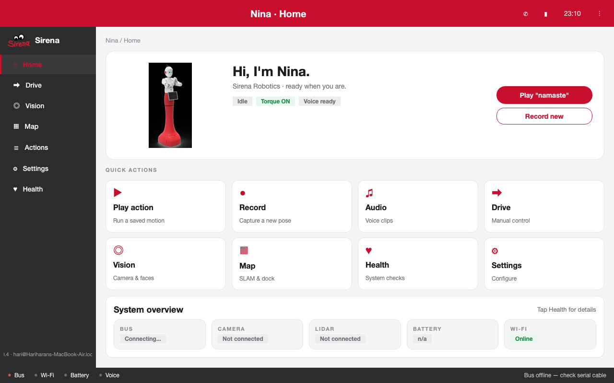
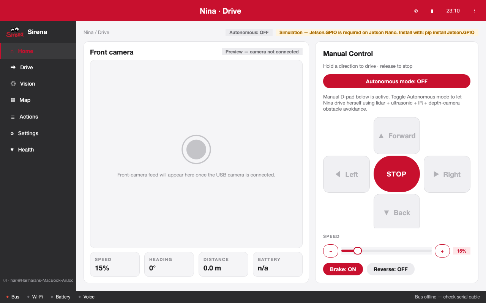
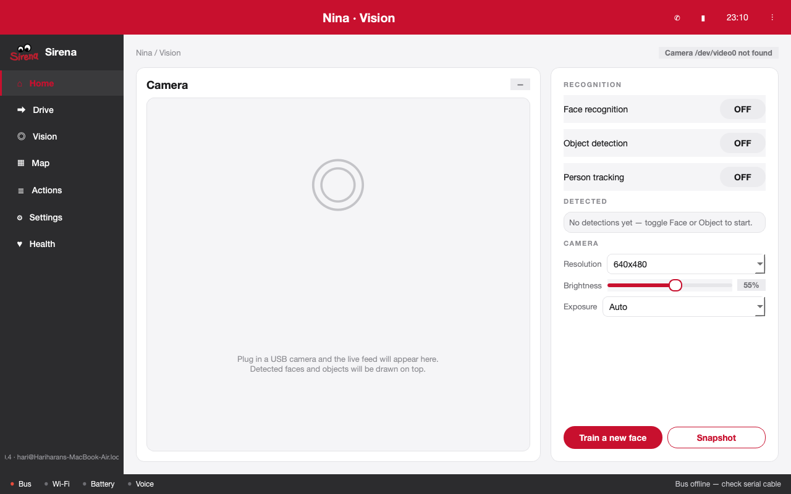
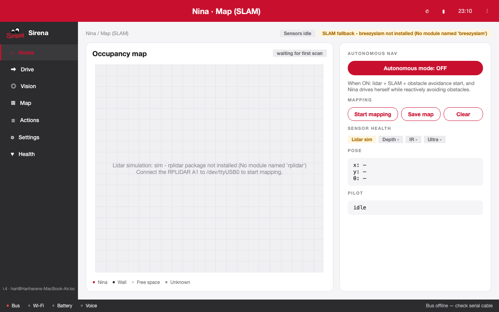
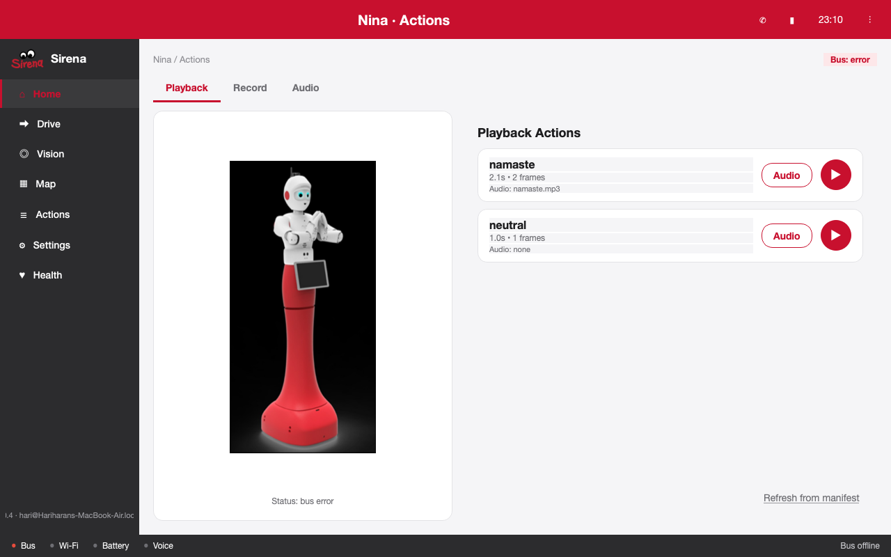
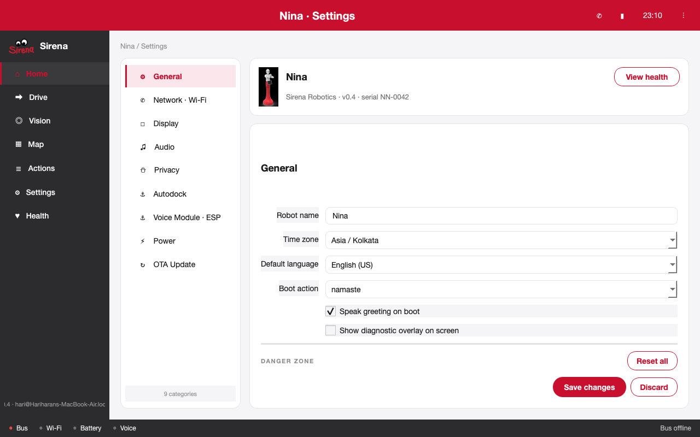
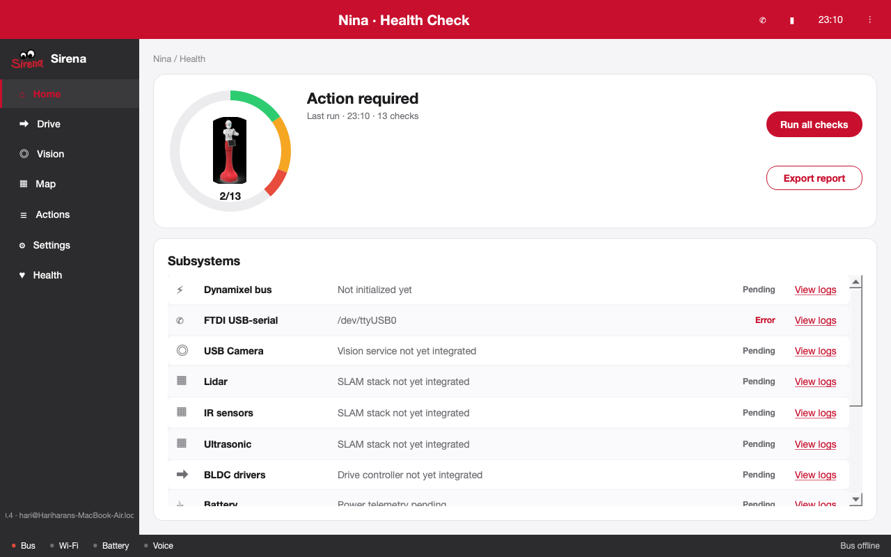

# Nina app — feature reference

PyQt5 desktop cockpit (`sirena_ui/`) for the Nina robot, designed for the Jetson's 10.1" touchscreen. Persistent left charcoal sidebar, Sirena red header (clock / Wi‑Fi / battery), charcoal status footer.

> **Kiosk display sizing.** Every screen is laid out for a **1024 × 600**
> design surface. The kiosk launcher (`scripts/launch-sirena.sh`) runs
> `xrandr` to force the panel into a real 1024 × 600 mode before Qt
> starts; without that step the cheap HDMI 10.1" panels advertise a
> generic 1920 × 1080 EDID and `showFullScreen()` overflows into that
> larger surface, leaving widgets stretched / clipped on the bot.
> See `REQUIREMENTS.md` § 5.2 step 10 (and § 6 troubleshooting) if the
> kiosk GUI looks wrong but the CLI launch looks correct.

> Every screenshot in this document is captured from the **real running app**
> (`PYTHONPATH=. python3 -m sirena_ui` under offscreen Qt) — no design
> mockups. Hardware that isn't present on the host shows up as
> "sim" / "Not connected" pills, which is the honest state when the
> docs are read on a non‑Jetson machine. On a Jetson Nano with the
> sensors wired in, those pills go green.

## Information architecture

```
+-- Home        Quick-action dashboard with Nina photo, status strip
+-- Drive       Manual BLDC control: virtual D-pad, speed slider, brake,
|                LIVE front-camera feed in the Front-camera card
+-- Vision      USB camera feed + face / object recognition controls
+-- Perception  Three-pane sensor fusion view: LiDAR + RGB + Depth
+-- Map         SLAM occupancy grid, sensor health, autonomous nav
+-- Actions     Existing record / play / audio - now in one screen
|     +-- Playback   list registered actions, smooth replay (+ optional audio)
|     +-- Record     release torque, capture frames, save into manifest
|     +-- Audio      gTTS author / tune / remove per-action audio clips
+-- Settings    Sub-sidebar: General / Network / Display / Audio / Privacy
|                Autodock / Voice (ESP) / Power / OTA Update
+-- Health      Donut + 13-row subsystem table, Run-all-checks
```

Cross-cutting design rules:

- **Single shared `NinaService`** owns the Dynamixel bus, drive, vision,
  SLAM and autonomy as **lazy singletons** with a deterministic
  shutdown order (autonomy → SLAM → vision → drive → DXL).
- All long-running work happens on `QThread`s / background queues —
  the UI thread never blocks on hardware.
- **Lazy screen construction**: each screen is built the first time
  the user navigates to it, so launch is instant.
- **Graceful degradation**: every hardware-touching screen surfaces a
  clear "sim" / "unavailable" pill if a driver, library or device is
  missing instead of crashing the app.
- **Explainable errors**: `workers/error_hints.py` rewrites raw OS
  errors (Permission denied, missing FTDI, no `dialout` group, …)
  into actionable Jetson-specific tips.

---

## Home — dashboard



- Hero card with the real Nina photo and current state pills
  (`Idle`, `Torque ON`, `Voice ready`).
- Two prominent CTAs — **Play actions** and **Record new** — that
  jump straight into the Actions screen.
- 8-tile **Quick actions** grid (Play action, Record, Audio, Drive,
  Vision, Map, Health, Settings) for one-tap navigation.
- **System overview** strip with at-a-glance pills for Bus, Camera,
  Lidar, Battery and Wi-Fi; tapping the title opens Health.

---

## Drive — manual BLDC control + autonomy hand-off



- **Front camera** preview pane shows the LIVE USB feed (drives the
  same `VisionWorker` the Vision and Perception screens use, via
  the `acquire()` / `release()` refcount so navigating between
  screens never tears the feed down). Falls back to a helpful
  "USB camera not connected" placeholder when no `/dev/videoN` is
  present. The feed comes up as soon as the operator visits the
  Drive screen for the first time and stays live until app
  shutdown — manual driving is first-person regardless of which
  other screen they navigate through.
- **Manual D-pad** with a big **STOP** in the centre and a **Brake** /
  **Reverse** state row underneath. Hold-to-drive, release-to-stop.
  Forward, Back, Left and Right are all held-while-pressed (release the
  button and the wheels coast to a stop), so steering during a left or
  right turn matches forward / back behaviour exactly.
- **Speed slider** (0–100 %) with `−` / `+` increment buttons. Sliding
  while a direction button is held now pushes the new duty straight to
  the motors — the wheels speed up / slow down live, no need to
  release-and-re-press to apply the change.
- **EMERGENCY STOP** — big red panic button below the toggle row.
  Drains pending drive commands, sets PWM duty to 0, engages the brake
  (EL low on both drivers) and lights all three status-LED channels.
  Independent of the regular Brake toggle so it works even mid-drive
  without first releasing the D-pad.
- Live **telemetry strip**: Speed, Heading, Distance, Battery.
- **Autonomous mode** toggle (mirrored on Map). When ON, the D-pad,
  brake, reverse and slider are disabled so the operator can't fight
  the autonomous pilot on the wheels.
- Top status pills surface the live driver state — `Autonomous: OFF`
  plus, on a non-Jetson host, an honest `Simulation — Jetson.GPIO is
  required on Jetson Nano. Install with: pip install Jetson.GPIO`.

Wiring: `workers/drive_controller.py` is a Qt facade over a
navigation manager. Two backends are supported, picked by
`NINA_NAV_MODE` and instantiated by
`nina.controllers.navigation_factory.build_navigation_manager`:

- **`NINA_NAV_MODE=local` (default).**
  `nina.controllers.navigation_manager.NavigationManager` drives the
  JYQDs directly from the Jetson Orin Nano's GPIOs. Pin map and quirks
  are documented immediately below.
- **`NINA_NAV_MODE=remote`.**
  `nina.controllers.remote_navigation_manager.RemoteNavigationManager`
  sends ASCII commands over a serial port to a Raspberry Pi running
  `pi_motor_bridge/motor_bridge.py`. The Pi owns the JYQDs. See
  [Remote mode (Pi motor bridge)](#remote-mode-pi-motor-bridge) below
  and `pi_motor_bridge/README.md` for the full setup.

Either way the GUI flow is identical: `drive_continuous(...)` for
D-pad presses (non-blocking, no auto-stop) and `set_wheels(...)` for
live speed updates and autonomous-pilot commands. The CLI tools still
use the timed `turn_left()` / `turn_right()` for scripted turns of a
fixed duration.

The local-mode driver is a clean port of the Sirena Raspberry Pi
reference build onto the Jetson Orin Nano. Pin map (mostly mirrors the
RPi; three pads are remapped because the Orin Nano image / carrier
doesn't expose them as plain GPIO — see notes below):

| Function    | BCM | Physical pin | Notes                  |
| ----------- | --- | ------------ | ---------------------- |
| L-EL        | 24  | 18           | digital out (see note) |
| L-DIR (Z/F) |  6  | 31           | digital out (see note) |
| L-PWM (VR)  | 12  | 32           | hardware PWM0          |
| R-EL        | 10  | 19           | digital out            |
| R-DIR (Z/F) | 23  | 16           | digital out (see note) |
| R-PWM (VR)  | 13  | 33           | hardware PWM2          |

> **R-DIR note.** The RPi reference puts R-DIR on BCM 22 / pin 15, but
> pin 15 is dead as a GPIO output on the Orin Nano carrier this bot
> uses (probed at constant 1.5 V regardless of what the kernel writes).
> BCM 23 / pin 16 is the workaround.
>
> **L-EL note.** The RPi reference puts L-EL on BCM 18 / pin 12, but
> pin 12 (PCM_CLK / I2S2_SCLK in the SoC pin table) is partially
> claimed by the Orin Nano audio device tree by default — GPIO writes
> get overridden, and the pad sits at a non-logic ~2.4 V ↔ ~4 V swing
> that the JYQD reads as "kind of HIGH most of the time." The visible
> symptom is a left wheel that occasionally spins, often jerks, and
> dies at higher PWM duty. BCM 24 / pin 18 is the workaround.
>
> **L-DIR note.** The RPi reference puts L-DIR on BCM 25 / pin 22, but
> pin 22 sits at a degraded ~0 V ↔ ~1.5 V intermittent toggle on this
> carrier (same alt-function-claim class as L-EL above). The JYQD
> reads 1.5 V as ambiguous and locks the left wheel's direction to
> whichever side of its threshold it last saw — the wheel can never
> reverse. BCM 6 / pin 31 is the workaround. Note BCM 6 collides with
> the default HC-SR04 rear-right TRIG channel; if you wire that
> ultrasonic sensor, override either pin via env var.

Both PWM pins must be enabled once via
`sudo /opt/nvidia/jetson-io/jetson-io.py` (Configure 40-pin Header →
manual → enable `pwm0` and `pwm2` → save → reboot).

Notable simplifications from earlier Jetson code (all driven by what
the working RPi build actually does):
- **No Signal pin.** The JYQD's `Signal` screw is left disconnected;
  the chip commutates fine with it floating.
- **No EL re-edge.** EL stays HIGH; direction is sampled
  level-sensitive. `stop()` zeroes PWM but keeps EL HIGH.
- **No kick-start, no deadband.** PWM ramps directly from 0 to the
  requested duty - same as the RPi reference.
- **Per-side hardware PWM.** L on BCM 12, R on BCM 13. True
  differential drive is supported.

Override individual pins via `NINA_NAV_L_EN`, `NINA_NAV_L_DIR`,
`NINA_NAV_L_PWM`, `NINA_NAV_R_EN`, `NINA_NAV_R_DIR`, `NINA_NAV_R_PWM`.

**Wheel polarity** (which way is "forward" for each motor) is now
adjustable from the Drive screen at runtime — see the **Flip L** /
**Flip R** toggles in the manual control card. The choice is
persisted to `~/.config/sirena/drive_polarity.json` and survives a
reboot or kiosk-service restart. The legacy `NINA_NAV_INVERT_LEFT=1` /
`NINA_NAV_INVERT_RIGHT=1` env vars still work as a **boot-time
default** when no persisted file exists; once the operator clicks a
toggle, the persisted value wins. Default cruise speed is
`NINA_NAV_SPEED=8` (GUI manual floor; override for faster cruises).
The BLDC **breakaway kick** is `NINA_NAV_START_KICK_PCT` (default **14**,
aligned with the top of the Drive slider). If a kiosk drop-in still sets
this to **35**, motion from a stop will briefly run at 35% PWM and feel
much faster than the slider.

#### Calibrating wheel polarity (1-minute procedure)

1. Mount the bot with the wheels free to spin (or set it on a low
   table edge so the wheels can rotate without grabbing).
2. Open the Drive screen, release the brake (`Brake: OFF`), set the
   speed slider toward the top (~14 %).
3. Press and hold **W** (or the on-screen Forward button) for ~2
   seconds. Watch the wheels.
4. **Both wheels going forward** — done.
5. **Both wheels going backward** — flip both `Flip L` and `Flip R`,
   re-test.
6. **Wheels going opposite directions** — flip whichever wheel is
   going the wrong way (`Flip L` if the left wheel is reversed,
   `Flip R` if the right wheel is reversed), re-test.

The setting is saved automatically; the next boot will reuse it.

### Remote mode (Pi motor bridge)

If the Jetson's GPIOs aren't a reliable way to drive the JYQDs (drive
strength, dead pads, alt-function claims), Nina supports offloading
**only** the motor switching to a Raspberry Pi. The Jetson keeps
running the GUI, vision, autonomy, sensors, SLAM, etc.; the Pi runs
`pi_motor_bridge/motor_bridge.py`, which owns the JYQDs and listens
for short ASCII commands over a serial link.

Architecture:

```
┌──────────────────────────┐                  ┌──────────────────────┐
│ Jetson Orin Nano         │                  │ Raspberry Pi         │
│   GUI / vision / nav     │  ── USB-UART ──> │   pigpiod            │
│   sensors / SLAM         │     115200 8N1   │   motor_bridge.py    │
│                          │  <── ack/event ──│   navigation_bldc.py │
│   RemoteNavigationMgr    │                  │   ─────► JYQD x2     │
└──────────────────────────┘                  └──────────────────────┘
```

The selection happens at `NinaService` construction time and applies
everywhere the GUI / autonomy / CLI tools touch motors — there's no
"local vs remote" branch in any caller; both managers implement the
same surface.

#### Wiring (recommended: USB-to-TTL adapter)

| USB-to-TTL adapter | Connect to                        |
|--------------------|-----------------------------------|
| USB                | Jetson USB-A (any free port)      |
| TX                 | Raspberry Pi pin 10 (BCM 15, RXD) |
| RX                 | Raspberry Pi pin 8  (BCM 14, TXD) |
| GND                | Raspberry Pi pin 6  (any GND)     |
| VCC                | NOT CONNECTED                     |

Adapter shows up on the Jetson as `/dev/ttyUSB0` (or `/dev/ttyUSB1` if
the Dynamixel adapter already took USB0).

> **Cross-over.** Adapter TX → Pi RX, Adapter RX → Pi TX. Wire the
> opposite of what the labels say.

The Pi-side wiring (JYQD ↔ Pi GPIO) is the proven RPi prototype
mapping, documented in `pi_motor_bridge/PINMAP.md`. If the Pi was
already driving these motors before, don't move any wires — just put
the JYQDs back where they were.

#### One-time Pi setup

```bash
# On the Raspberry Pi:
sudo raspi-config
#   3 Interface Options
#     I6 Serial Port
#       "Login shell over serial?"     -> No
#       "Serial port hardware enabled?"-> Yes
#   reboot

sudo apt install -y pigpio python3-pigpio
sudo pip3 install pyserial
sudo systemctl enable --now pigpiod

# Get the bridge files onto the Pi (e.g. scp the whole pi_motor_bridge/
# directory over from the Jetson, or git clone the repo on the Pi).

cd pi_motor_bridge
# (one-shot test in foreground:)
sudo python3 motor_bridge.py --verbose

# (or install as a systemd service so it auto-starts on boot:)
sudo bash install_service.sh
sudo systemctl status motor-bridge
```

#### Switch the Jetson over to remote mode

```bash
# On the Jetson:
export NINA_NAV_MODE=remote
export NINA_NAV_REMOTE_PORT=/dev/ttyUSB0   # or /dev/ttyUSB1 if Dynamixel took USB0
export NINA_NAV_REMOTE_BAUD=115200

# Smoke-test the link end-to-end (no GUI):
python3 -m nina.app.nav_bridge_test --port /dev/ttyUSB0 --speed 25 --duration 3

# Quick connectivity check via the main CLI:
python3 -m nina.app.main nav-bridge-ping
```

If the smoke test passes, launch the GUI normally — `NinaService`
reads `NINA_NAV_MODE` at startup and the Drive screen, autonomy pilot,
and CLI tools all route through the bridge automatically.

#### Wire protocol (for reference)

ASCII over 115200 8N1, newline-terminated. Documented in detail in
`pi_motor_bridge/motor_bridge.py`.

| Direction | Line                                  | Reply       | Effect                                    |
|-----------|----------------------------------------|-------------|-------------------------------------------|
| J → Pi    | `PING`                                 | `PONG`      | health-check                              |
| J → Pi    | `SET <ldir> <lspeed> <rdir> <rspeed>`  | `OK`/`ERR`  | per-wheel direction + speed               |
| J → Pi    | `STOP`                                 | `OK`        | PWM=0, EL stays HIGH (chip armed)         |
| J → Pi    | `ESTOP`                                | `OK`        | PWM=0, EL LOW (chip disabled, no torque)  |
| J → Pi    | `LED <CONNECTED|ERROR|WAITING|OFF>`    | `OK`/`ERR`  | status LED                                |
| Pi → J    | `READY`                                | -           | bridge has finished GPIO init             |
| Pi → J    | `EVT WATCHDOG`                         | -           | Pi stopped wheels because Jetson went silent while moving |

A 1.5 s **watchdog** on the Pi side stops the wheels if no command
arrives while they're commanded to move, so a Jetson crash or unplugged
cable can't run the bot away. Tune via `NINA_BRIDGE_WATCHDOG_SEC` on
the Pi.

#### Remote-mode env vars

| Var                            | Default            | Meaning                                            |
|--------------------------------|--------------------|----------------------------------------------------|
| `NINA_NAV_MODE`                | `local`            | `local` (Jetson GPIO) or `remote` (Pi bridge)      |
| `NINA_NAV_REMOTE_PORT`         | `/dev/ttyUSB0`     | Serial device on the Jetson                        |
| `NINA_NAV_REMOTE_BAUD`         | `115200`           | Must match `motor_bridge.py --baud` on the Pi      |
| `NINA_NAV_REMOTE_TIMEOUT_SEC`  | `0.4`              | Per-line response wait                             |
| `NINA_NAV_INVERT_LEFT`         | `0`                | Flip left wheel forward/backward — boot-time default; the Drive screen's **Flip L** toggle wins once clicked. Persisted to `~/.config/sirena/drive_polarity.json`. |
| `NINA_NAV_INVERT_RIGHT`        | `0`                | Flip right wheel forward/backward — boot-time default; the Drive screen's **Flip R** toggle wins once clicked. Same persistence. |
| `NINA_BRIDGE_PORT` (on the Pi) | `/dev/serial0`     | Serial device on the Pi                            |
| `NINA_BRIDGE_BAUD` (on the Pi) | `115200`           | Pi-side baud                                       |
| `NINA_BRIDGE_WATCHDOG_SEC` (on the Pi) | `1.5`      | Stop wheels if Jetson goes silent while moving     |
| `NINA_UI_OSK`                  | `auto`             | Touchscreen on-screen keyboard. `auto` = pop up on focus when the OSK binary is on PATH; `always` = launch at startup; `off` = disable entirely. |
| `NINA_UI_OSK_BIN`              | `onboard`          | OSK binary to launch (`florence`, `matchbox-keyboard`, etc. all work). |
| `NINA_UI_OSK_ARGS`             | (empty)            | Shell-style extra args, e.g. `--theme=Nightshade --not-show-in-launcher`. |
| `NINA_UI_FULLSCREEN`           | unset              | `1` puts the GUI in frameless kiosk mode sized exactly to the panel's QScreen geometry (no `_NET_WM_STATE_FULLSCREEN` flag, so the on-screen keyboard can stack above). |
| `NINA_UI_FULLSCREEN_STRICT`    | unset              | `1` switches kiosk mode to true X11 fullscreen-exclusive (`_NET_WM_STATE_FULLSCREEN`). Only set this if you have **no** OSK and want the WM to absolutely guarantee no other window stacks above the kiosk — the on-screen keyboard will be invisible behind it in this mode. |
| `NINA_UI_RESTART_CMD`          | unset              | Optional shell command run after a successful **Home → Pull changes** `git pull`, instead of re-exec'ing Python. Kiosk/systemd installs often set e.g. `systemctl --user restart nina-ui-kiosk` so the app restarts through `launch-sirena.sh` with the same environment. |

#### Touchscreen on-screen keyboard

The Nina ships with a 10.1" capacitive touchscreen and no physical
keyboard, so the GUI auto-launches `onboard` (Ubuntu's standard OSK)
the first time a text field gets focus — Wi-Fi password entry on the
Settings screen, recording-rename dialogs, action editor text fields,
etc. The kiosk installer runs `apt-get install -y onboard` for you;
if you skipped that step you can install it manually:

```bash
sudo apt install -y onboard
```

Behaviour you can rely on:

- The keyboard pops up the **first** time any text-input widget gains
  focus. If the operator dismisses it via its X button, the **next**
  text-field focus re-spawns it.
- Buttons / D-pad / sliders never summon the keyboard — only
  `QLineEdit`, `QTextEdit`, `QPlainTextEdit`, `QSpinBox`, and
  *editable* `QComboBox` widgets do.
- Onboard's docking position, theme, and layout are configured
  through onboard's own preferences pane (right-click its window →
  **Preferences**). `NINA_UI_OSK_ARGS` lets you preset a theme via
  `--theme=Nightshade` or similar at launch.
- The first onboard launch each session writes
  `org.onboard.window force-to-top=true` via `gsettings` so the
  keyboard claims `_NET_WM_STATE_ABOVE` and stacks above the kiosk.
  We deliberately leave `docking-enabled` alone — turning it on
  switches onboard from "floating window dismissed by its X button"
  into a persistent dock that auto-hides on focus-out, and Qt apps
  don't reliably emit the AT-SPI focus events onboard needs to
  re-show itself, so the keyboard would only appear once per session.
  Floating-window mode means each spawn pops a fresh visible
  keyboard, dismissal cleanly exits the process, and the next
  text-field focus re-spawns it.
- Set `NINA_UI_FULLSCREEN_STRICT=1` to opt back into true X11
  fullscreen-exclusive mode — the keyboard will be hidden behind
  the kiosk in that case (use only if you don't need the OSK).
- On dev hosts (Mac, headless CI) the binary isn't found, so the
  manager silently disables itself with a one-time warning in the
  log — the GUI still comes up cleanly.

The local-mode `nav-test-direction` and `nav-test-pin` CLI commands
refuse to run in remote mode — they probe Jetson GPIOs, which the Pi
now owns.

---

## Vision — USB camera + perception



- **Live camera card** showing the USB feed (`/dev/video<N>`,
  configurable via `NINA_VISION_CAMERA`) with bounding-box overlays.
- **Recognition** toggles on the right rail:
  - **Face detection** — YuNet (`cv2.FaceDetectorYN`); ships with
    OpenCV ≥ 4.5.4. The 340 KB ONNX model is downloaded once to
    `nina/models/weights/face_detection_yunet_2023mar.onnx`. When
    enabled, also lazy-loads the **SFace** recogniser
    (`cv2.FaceRecognizerSF`, ~38 MB ONNX cached at
    `nina/models/weights/face_recognition_sface_2021dec.onnx`) so
    enrolled faces are matched to a name in real time.
  - **Object detection** — Ultralytics YOLOv8n on COCO-80. On Jetson
    the pipeline auto-exports a **TensorRT FP16** engine on first
    run (`nina/models/weights/yolov8n.engine`) and caches it; PyTorch
    CPU fallback on dev hosts.
  - **Object confidence** slider (50–99%). YOLO's per-prediction
    confidence floor is set live via `VisionWorker.set_object_confidence`,
    so dragging the slider tightens / loosens detections without
    rebuilding the TensorRT engine. Defaults to **80%** (override via
    `NINA_VISION_OBJECT_CONF=0.85` env var if you want a different
    starting point).
  - **Person tracking** — toggle for the next iteration's tracker.
- **Detected** rolling list shows the class (or recognised name) and
  match score for each visible detection.
- **Camera** controls: resolution dropdown (640×480 / 1280×720 / etc),
  brightness slider, exposure mode.
- **Train a new face** opens the enrolment dialog. Type a name, look
  at the camera, and Nina captures 8 high-confidence samples of a
  single face. The averaged 128-d SFace embedding is persisted to
  `nina/data/faces.json`. Subsequent recognitions draw the matched
  name + cosine score on the bbox and trigger an automatic **"Hello
  <name>"** greeting (cached at `nina/data/greetings/<name>.mp3`,
  cooldown 30 s per person to avoid spam).
- **Snapshot** saves the current frame to `~/Pictures/nina-snapshots/`.
- **Play Objects** speaks the labels currently visible to the YOLO
  detector ("I see a person, two chairs and a bottle.") via gTTS +
  the standard `AudioPlayer`. Disabled until the detector reports at
  least one box. Each unique sentence is cached as an MP3 under
  `nina/data/announcements/` so repeat scenes replay instantly with
  no internet round-trip; a 1.5 s cooldown stops a double-click from
  overlapping playbacks.
- Top pill diagnoses missing hardware: `Camera /dev/video0 not
  found`, `OpenCV not installed`, `Ultralytics not installed`, etc.

---

## Perception — live LiDAR + RGB + Depth

A read-only three-pane viewer that shows everything the autonomy
stack actually senses, side-by-side, on a single screen. Useful both
during autonomous driving (to verify "why did the bot turn right?"
against ground truth) and for sensor bring-up (any pane that stays in
its placeholder is a sensor that didn't come up).

```
+--------------------+--------------------+--------------------+
| LiDAR              | RGB camera         | Depth (D435)       |
| BreezySLAM grid    | Live USB feed      | JET-coloured depth |
| + pose triangle    | (same as Drive +   | + F/L/R numeric    |
|                    |  Vision screens)   |   distance overlay |
+--------------------+--------------------+--------------------+
| [ Autonomous mode toggle ]  status text                      |
+--------------------------------------------------------------+
```

Wiring details that matter for ops:

- **Lidar** — uses `service.slam` (the same `SlamWorker` the Map
  screen reads). Starting the screen calls `slam.start()`, which is
  idempotent so it doesn't fight whatever the Map screen is doing.
- **RGB** — uses `service.vision` via the new
  `VisionWorker.acquire()` / `release()` refcount, so opening
  Perception while Drive / Vision are also showing the feed
  doesn't open the camera twice (and leaving Perception doesn't
  yank it out from under those screens).
- **Depth** — uses `AutonomyController.acquire_depth()` /
  `release_depth()` with the same refcount pattern, so the
  Perception screen can keep the D435 open for visualization
  even when autonomy is **OFF**, AND a later autonomy-enable
  doesn't try to re-open the busy device.
- **Depth visualization** — only enabled while the Perception
  screen is the visible screen; toggled off in `on_leave` so the
  per-frame `cv2.applyColorMap` cost (~5–10 ms / frame on Jetson
  Nano) only runs when an operator is actually watching.
- **Numeric overlay** under the Depth pane shows the SAME
  `forward_min_mm` / `left_min_mm` / `right_min_mm` values the
  pilot consumes from the latest `DepthFrame` — not a separate
  read that could disagree by a frame. Distances ≥ 1 m render
  in metres for readability ("F: 1.42 m   L: 0.62 m   R: 0.31 m").
- **Autonomous mode toggle** at the bottom is the same
  `AutonomyController.set_enabled()` the Map and Drive screens
  call; flipping it from any of the three screens reflects in
  the others via `enabled_changed`.

Header pills surface per-sensor state at a glance:
`Lidar OK / sim / -`, `Cam OK / -`, `Depth OK / sim / -`,
`Autonomous: ON / OFF`. A sensor that's missing on the bot stays
in a placeholder ("Lidar not connected", "USB camera not
connected", "Depth camera not connected") instead of crashing the
screen.

> **Why a separate screen and not the Drive screen?** The Drive
> screen is the manual-driving cockpit at 1024 × 600 — it's already
> packed (D-pad + speed slider + polarity flips + brake / reverse /
> E-STOP) and squeezing three sensor previews into it would either
> shrink each preview below useful or push the manual controls
> off the panel. The Front-camera card on the Drive screen still
> shows the live RGB feed (always on) so manual driving remains
> first-person; the LiDAR + Depth panes live on Perception, which
> is one nav-click away.

---

## Map — SLAM + sensor fusion + autonomy



- **Occupancy map** card on the left, drawing BreezySLAM's RMHC\_SLAM
  byte-map (walls black, free space light, unknown grey) plus a
  Sirena red triangle pose marker. Falls back to a passthrough
  rasteriser if BreezySLAM isn't installed, so the screen still
  renders raw lidar points.
- **Autonomous mode** toggle (mirrored on Drive). Turning it on:
  1. Starts the SLAM worker (lidar + BreezySLAM).
  2. Opens the HC-SR04 ring, the IR cliff sensor and the D435.
  3. Spawns the `AutonomousPilot` reactive controller (5 Hz default)
     for the wander stack.
- **Go to point** card. Press `Tap on map` to arm click-to-set-goal,
  then tap a free-ish cell on the occupancy grid. The
  `OccupancyGridView` widget translates the click to world mm,
  `AutonomyController.set_goal()` swaps the active pilot to
  `GotoPilot`, and the pilot:
  1. Plans an A* path on the BreezySLAM bytemap. Walls are dilated
     by `max(NINA_GOTO_INFLATE_MM, ⌈NINA_GOTO_MIN_PASSAGE_MM / 2⌉)`
     so paths simultaneously (a) leave a Nina-shaped buffer around
     the body and (b) refuse any corridor narrower than the
     `NINA_GOTO_MIN_PASSAGE_MM` floor (default 2 ft / 610 mm — the
     smallest gap Nina is approved to thread).
  2. Follows the path with a pure-pursuit lookahead
     (`NINA_GOTO_LOOKAHEAD_MM`), turning in place when the
     heading error exceeds `NINA_GOTO_HEAD_DEG` and driving
     forward otherwise.
  3. Re-runs `obstacle_field.fuse()` every tick and aborts +
     replans whenever the live sensors disagree with the planner
     (e.g. a person walks in, an unmapped chair below the lidar
     plane). The same cliff / e-stop layer the wander pilot uses
     gates forward motion.
  4. Stops on arrival and stays put (no auto-resume to wander).
- The Go to point card surfaces the pilot's state pill
  (`planning / driving / turning / replanning / avoiding / arrived
  / unreachable / stuck / lost`) plus the live distance-to-goal,
  and renders the planned waypoints as a dashed red polyline on
  the occupancy grid with a flag pin at the goal.
- The Perception screen's lidar pane shares the same widget; when
  autonomy is ON, taps on that pane also fire `set_goal()` so the
  operator can reuse the screen they were already on for sensor
  triage.
- **Mapping** action row: **Start mapping** (SLAM only, no driving),
  **Save map** (PGM dump of the current grid), **Clear** (reset and
  replay live scans into a fresh map).
- **Sensor health** pills — one per sensor (`Lidar`, `Depth`, `IR`,
  `Ultra`) with live / sim / error status.
- **Pose** card: live `x / y / θ` from the SLAM engine.
- **Pilot** card: last decision + reason from `AutonomousPilot`
  (`cruising · forward clear 1.4 m`, `turning right · left blocked
  280 mm`, `e-stop · cliff alarm`, `idle`).
- **Goto pilot** card (when goto is active): planner waypoints
  remaining, current state, and reason — surfaced verbatim from
  `GotoPilot.GotoState` so log lines and UI lines line up.
- Top pill explains any degraded state in plain English (`SLAM
  fallback - breezyslam not installed`).

### Sensors (`nina/sensors/`)

| Role            | Part            | Mount                                          |
| --------------- | --------------- | ---------------------------------------------- |
| 360° lidar      | Slamtec RPLIDAR S2E (default) / A1M8 (legacy) | Head; S2E speaks UDP at `192.168.11.2:8089`, A1 speaks USB-serial at `/dev/ttyUSB0`. The `nina.sensors.lidar_factory.build_lidar` factory picks the driver from `NINA_LIDAR_MODEL` |
| Depth camera    | Intel RealSense D435 | Front of chassis, ~10° downtilt, USB 3    |
| IR cliff        | Sharp GP2Y0E02B | Front bumper, downward, I²C bus 1, addr `0x40` |
| Ultrasonic ring | 4× HC-SR04      | Chassis FL/FR/RL/RR, BCM GPIO                  |

Each driver soft-imports its vendor library, exposes an
`is_available()` check, and runs its own background thread so the
SLAM engine can read the latest reading without blocking. A missing
sensor doesn't take down the rest — the pilot keeps running on
whatever sensors are alive.

### Pilot behaviour ("safe wander", V1)

- Forward when `forward ≥ NINA_AUTO_FWD_CLEAR_MM` (default 700 mm)
  AND both side margins exceed `NINA_AUTO_SIDE_CLEAR_MM` (350 mm).
- Otherwise commit a brief in-place turn toward the clearer side for
  `NINA_AUTO_TURN_MS` ms (default 350) and re-evaluate.
- If any sector drops below `NINA_AUTO_ESTOP_MM` (300 mm) **or** the
  IR sensor fires the cliff alarm, reverse for
  `NINA_AUTO_BACKOFF_MS` ms and re-pick a direction.
- **Layer 0 safety**: if every sensor returns no reading, the pilot
  stops and reports "all sensors blind" instead of driving deaf.

---

## Actions — record / play / audio



Three sub-tabs share a left-rail Nina photo + status line:

- **Playback** *(shown above)*. Lists every action registered in the
  manifest (`namaste`, `neutral`, …) with duration, frame count and
  audio summary. Each row exposes a Sirena red **Play** button (smooth
  replay through `NinaService` with synchronised audio if a clip
  exists) and an **Audio** shortcut that jumps to the editor with the
  right action pre-selected. **Refresh from manifest** picks up new
  recordings without restarting the app.
- **Record**. Releases torque on the configured Dynamixel IDs,
  captures frames at the chosen rate, and saves a JSON clip into
  `nina/actions/recordings/`. The new clip is registered in the
  manifest atomically.
- **Audio** (gTTS). Pick an action from the dropdown, type the words
  to speak (defaults to the action name), pick a voice preset (US,
  UK, Australian, Indian, Hindi, …), set an `audio_offset` (seconds
  of motion before the clip fires), then **Preview**, **Generate &
  Save**, **Save offset** or **Remove**. The MP3 is rendered with
  gTTS, saved to `nina/actions/audio/<action>.mp3`, and the manifest
  is updated atomically.

The same authoring is also exposed as
`scripts/generate-action-audio.py` for headless use.

---

## Settings — 9 categories with sub-sidebar



A secondary light-grey sub-sidebar lists the nine categories
(General, Network · Wi-Fi, Display, Audio, Privacy, Autodock, Voice
Module · ESP, Power, OTA Update). The top of the right pane shows a
small **Nina identity card** (photo, robot name, version, serial)
with a **View health** shortcut.

The **General** pane (shown above) is fully wired:

- Robot name, time zone, default language, boot action.
- Toggles: *Speak greeting on boot*, *Show diagnostic overlay on
  screen*.
- **Save changes** persists to `nina/config/settings.py`’s
  `NinaSettings`; **Discard** rolls back; **Reset all** wipes to
  defaults.

The non-General categories ship as polished UI scaffolds backed by
in-process stubs — firmware can replace each stub without touching
the UI.

---

## Health — donut + subsystem table



- **Donut gauge** with the real Nina photo inset in the hole. The
  ring shows OK / Warn / Error split (green / amber / red) and the
  centre text shows `<ok>/<total>` checks passing.
- Banner heading flips between **All systems nominal** and **Action
  required** based on the worst row.
- **Subsystem table** with 13 rows: Dynamixel bus, FTDI USB-serial,
  USB Camera, Lidar, IR sensors, Ultrasonic, BLDC drivers, Battery,
  Temperature, CPU, Storage, Network, Audio. Each row has its own
  `View logs` shortcut and a status pill (`OK`, `Pending`, `Warning`,
  `Error`).
- **Run all checks** kicks off a fresh sweep through
  `workers/health_collector.py`; **Export report** dumps a JSON
  snapshot for support tickets.

---

## Threading & service model

```
sirena_ui/                       nina/
  workers/                         controllers/
    nina_service.py  ──────────►   navigation_manager.py  (BLDC)
       │                           dynamixel_manager.py    (DXL bus)
       ├── drive_controller.py
       ├── vision_worker.py        sensors/
       ├── slam_worker.py    ────► lidar_factory.py ─► slamtec_s2e.py / rplidar_a1.py
       ├── autonomy_controller.py  hcsr04.py
       │                           gp2y0e02b.py
       ├── playback_worker.py      realsense_d435.py
       ├── record_worker.py
       ├── audio_gen_worker.py     slam/
       └── health_collector.py     engine.py            (BreezySLAM)

                                   navigation/
                                     obstacle_field.py
                                     autonomous_pilot.py
```

- `NinaService` owns the single `DynamixelManager` and exposes a
  `bus_lock` (`threading.RLock`).
- `PlaybackWorker` and `RecordWorker` are `QThread`s that acquire
  the bus lock for their duration, so they can never race on the
  serial port.
- `DriveController`, `VisionWorker`, `SlamWorker` and
  `AutonomyController` each own a dedicated background thread for
  their hardware loop and emit Qt signals back to the UI thread.

---

## Tunable env vars (high-traffic)

```bash
# Navigation backend (local Jetson GPIO vs remote Pi serial bridge)
# See "Remote mode (Pi motor bridge)" above for the full setup.
export NINA_NAV_MODE=local                     # or 'remote' for the Pi bridge
export NINA_NAV_REMOTE_PORT=/dev/ttyUSB0       # only used in remote mode
export NINA_NAV_REMOTE_BAUD=115200             # must match motor_bridge.py on Pi
export NINA_NAV_INVERT_LEFT=0                  # flip left wheel forward/backward
export NINA_NAV_INVERT_RIGHT=0                 # flip right wheel forward/backward
# Drive "Straight 15 s" bench test: sustained PWM % (default: MAX_SPEED_PCT, same as slider max).
# export NINA_STRAIGHT_TEST_SPEED_PCT=14

# Vision
export NINA_VISION_CAMERA=0
export NINA_VISION_TRT=1                       # 0 = force PyTorch CPU
export NINA_VISION_YOLO_WEIGHTS=/path/to.pt
# Preview latency: max width of frame passed to Qt (default 640); smaller = less GUI work.
export NINA_VISION_PREVIEW_MAX_W=640
# Qt refresh interval (ms) when the preview buffer changed (default 20).
export NINA_VISION_PREVIEW_MS=20
# Worker loop target rate when inference is fast (default 30); slow detectors still dominate.
export NINA_VISION_TARGET_FPS=30
# Face greetings (Vision): cached MP3s under nina/data/greetings/<name>.mp3 (repo root).
# Playback: sudo apt install -y mpg123 alsa-utils espeak-ng pulseaudio-utils
# (mpg123 for MP3; espeak-ng writes WAV then aplay or paplay; logs stderr on failure).
# Troubleshooting: if `espeak-ng: command not found`, install the package above — without
# it, no WAV is produced and aplay/paplay report "No such file or directory" for /tmp/t.wav.
# If aplay is silent but `paplay /tmp/t.wav` works, audio is on Pulse: keep pulseaudio-utils
# installed; FaceGreeter tries paplay after aplay fails.
# If aplay uses the wrong ALSA device, set e.g.:
# export NINA_GREET_APLAY_DEVICE=plug:dmix
# Before TTS/MP3 playback: mute output → wait → unmute (reduces amp/USB stutter).
# Uses pactl @DEFAULT_SINK@ if available, else amixer sset (see NINA_AUDIO_MIXER_*).
# export NINA_AUDIO_MUTE_PREROLL_SEC=2
# export NINA_AUDIO_MIXER_CARD=0          # optional amixer -c (empty = default card)
# export NINA_AUDIO_MIXER_CONTROL=Master    # or PCM, Speaker, etc.
# If mute preroll fails: optional fallback, play this many ms of silence via aplay (default 0).
# export NINA_AUDIO_PREROLL_MS=0
# Person follow: PWM % and timing (defaults are slow/stable).
export NINA_FOLLOW_APPROACH_PCT=11
export NINA_FOLLOW_CRUISE_PCT=9
export NINA_FOLLOW_BACK_PCT=9
export NINA_FOLLOW_NUDGE_PCT=9
export NINA_FOLLOW_YAW_GAIN=3.5
# Lost-target search: slow stepped in-place rotation (~step_deg per pulse), pause to look, repeat to ~360°.
# Tune STEP_MS + SEARCH_PCT on hardware so each pulse matches step_deg; LOOK_TICKS × TICK_MS ≈ dwell per station.
export NINA_FOLLOW_SEARCH_STEP_DEG=30
export NINA_FOLLOW_SEARCH_STEP_MS=900
export NINA_FOLLOW_SEARCH_LOOK_TICKS=4
export NINA_FOLLOW_SEARCH_PCT=5
# Consecutive no-face ticks after a lock before 360° scan (debounce).
export NINA_FOLLOW_LOST_TICKS=4
# Consecutive face ticks before we trust detections (clear lost / exit search).
export NINA_FOLLOW_CONFIRM_TICKS=2
# Person-follow Qt timer period in ms (default 50 ≈ 20 Hz; lower = snappier).
export NINA_FOLLOW_TICK_MS=50

# Lidar
export NINA_LIDAR_PORT=/dev/ttyUSB0
export NINA_LIDAR_BAUD=115200

# Ultrasonic ring (BCM pin numbers; defaults shown)
export NINA_HCSR04_FL_TRIG=19 NINA_HCSR04_FL_ECHO=9
export NINA_HCSR04_FR_TRIG=7  NINA_HCSR04_FR_ECHO=8
export NINA_HCSR04_RL_TRIG=11 NINA_HCSR04_RL_ECHO=4
export NINA_HCSR04_RR_TRIG=6  NINA_HCSR04_RR_ECHO=26
# NINA_HCSR04_DISABLE=1 to skip the ring entirely

# IR cliff
export NINA_IR_I2C_BUS=1
export NINA_IR_I2C_ADDR=0x40

# Depth
export NINA_DEPTH_FPS=15
# NINA_DEPTH_DISABLE=1 to skip the D435

# Pilot tuning
export NINA_AUTO_TICK_HZ=5
export NINA_AUTO_CRUISE_PCT=18
export NINA_AUTO_FWD_CLEAR_MM=700
export NINA_AUTO_ESTOP_MM=300
export NINA_AUTO_CLIFF_MIN_MM=60

# SLAM map sizing
export NINA_SLAM_PIXELS=800
export NINA_SLAM_METERS=20
```

---

## Re-capturing the screenshots

The PNGs in `sirena_ui/docs/screens/` are produced by booting the
real `MainWindow` under offscreen Qt and saving each screen via
`QWidget.grab()`. To regenerate them after a UI change:

```bash
PYTHONPATH=. python3 sirena_ui/docs/_capture_screens.py
```

The script monkey-patches `QMessageBox` so dialogs don't block, and
it intentionally runs without any robot hardware — every "sim" /
"Not connected" pill in the captures is real screen state, not a
mockup.

---

## Status of each screen

| Screen   | Wiring                                       | Notes                                          |
| -------- | -------------------------------------------- | ---------------------------------------------- |
| Home     | Live status pills + manifest                  | Quick-action tiles deep-link into every screen |
| Drive    | Live BLDCs (`NavigationManager` local OR `RemoteNavigationManager` via Pi bridge) | Sim fallback when backend isn't reachable     |
| Vision   | Live USB cam + YuNet + YOLOv8 (TensorRT FP16) | `Person tracking` is next-iteration            |
| Map      | Live Slamtec S2E (or A1) + HC-SR04 + IR + D435 + SLAM | `safe wander` autonomy V1                |
| Actions  | Live Dynamixel record / playback + gTTS audio | Manifest is the source of truth                |
| Settings | General pane is live                          | Other 8 categories are scaffolds + stubs       |
| Health   | Live donut + Dynamixel rows                   | Non-DXL rows wait on subsystem integrations    |
